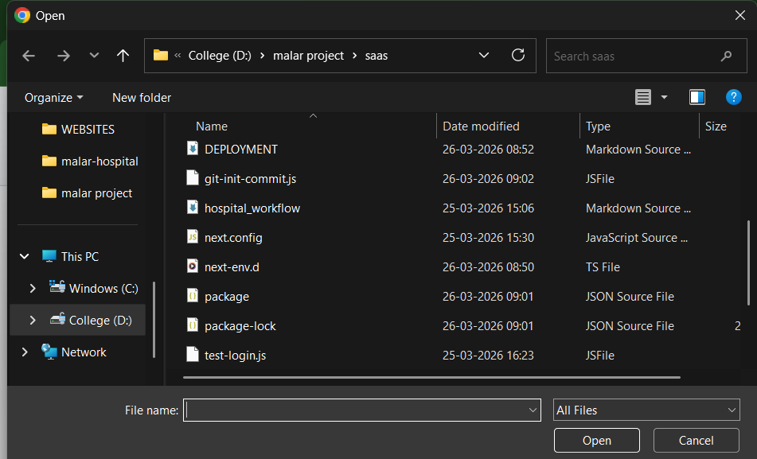

# Malar Hospital SaaS - Deployment Guide

To make this a fully working website app, follow these 3 simple steps:

## 1. Prepare for Production
Run the build locally to ensure everything is perfect:
```bash
npm run build
```

## 2. Choose a Hosting Provider
- **Vercel (Recommended)**: Best for Next.js. Simply push your code to GitHub and "Import" the project on Vercel.
- **Railway/Render**: Good for PostgreSQL-based apps.

## 3. Database Strategy
Currently, the app uses **SQLite**. 
- **Quick Demo**: Keep SQLite. Vercel will allow it, but data will reset on every redeploy.
- **Real App**: Change `provider = "sqlite"` to `provider = "postgresql"` in `prisma/schema.prisma` and use a **Supabase** or **Neon** database URL.

## PWA Support
This app is ready to be installed on your phone or tablet!
1. Open the website in Chrome or Safari.
2. Click the "Share" or "Menu" icon.
3. Select **"Add to Home Screen"**.

Now you can use Malar Hospital SaaS like a native app on your device!
